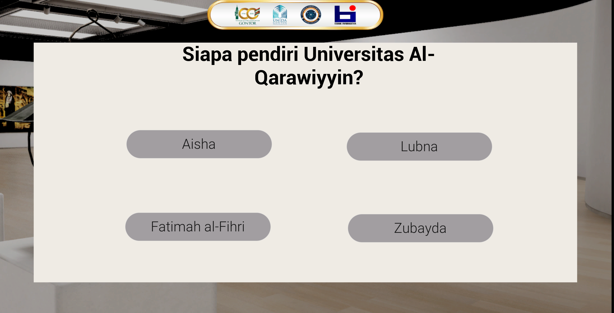

# Rise of the Muslimah Scholar

## Description
Rise of the Muslimah Scholar is an educational action game developed as a thesis project.  
The game introduces players to the history and contributions of Muslim women scholars through interactive exploration and quiz-based challenges.

---

## Screenshots

  
  
  
  
  
  
  

---

## Features
- Exploration-based gameplay  
- FPS / TPS perspective selection  
- Educational gallery content  
- Interactive quizzes  

---

## Technologies Used
- Unreal Engine  
- Blueprint / C++  

---

## How to Run
1. Clone this repository  
2. Open the `.uproject` file  
3. Build / Play the project

## Playable Build
Download the packaged game from the [Releases] section.

---

## Controls
- **W A S D** → Movement  
- **Mouse** → Camera  
- ** E ** → Interact  
- ** C ** → Switch Perspective (FPS / TPS)  
- ** Backspace ** → Back

---

## Author
Rizka Fitria Indhira
